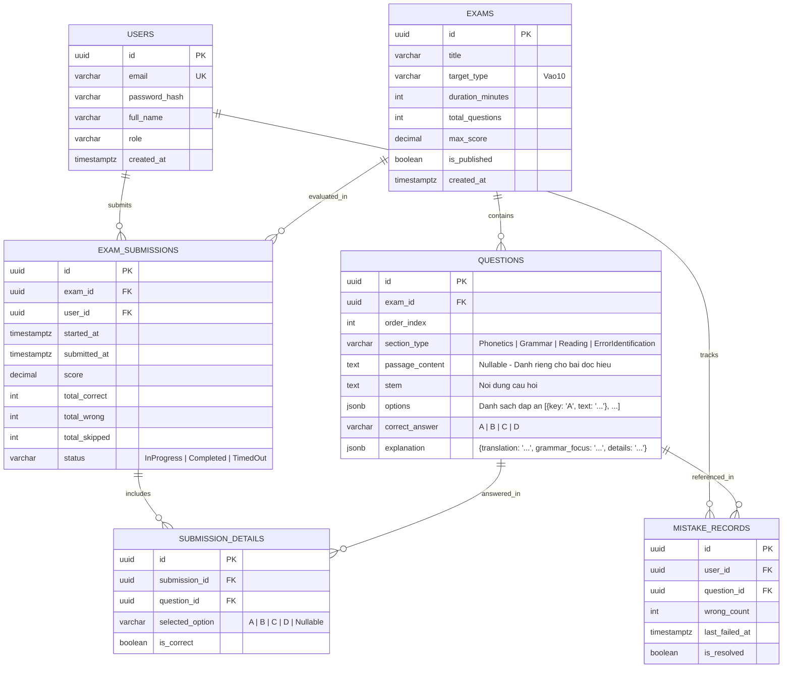

# Thiết Kế Mô Hình Cơ Sở Dữ Liệu (Database Schema Design)

## 1. Sơ Đồ Quan Hệ Thực Thể (Entity Relationship Diagram - ERD)



---

## 2. Chi Tiết Các Bảng Dữ Liệu

### 2.1. Bảng `exams`
* **Mục đích:** Lưu trữ thông tin đề thi vào lớp 10.
* **Các trường:**
  * `id` (UUID, Primary Key): Định danh duy nhất của đề thi.
  * `title` (VARCHAR(255), Not Null): Tên đề thi (VD: *Đề thi thử Tuyển sinh Lớp 10 - Hà Nội 2026*).
  * `target_type` (VARCHAR(50), Not Null): Phân loại mục tiêu (mặc định: `Vao10`).
  * `duration_minutes` (INT, Not Null): Thời lượng làm bài (mặc định: 60).
  * `total_questions` (INT, Not Null): Tổng số câu trong đề (40 hoặc 50).
  * `max_score` (DECIMAL(4,2), Not Null): Điểm số tối đa (mặc định: 10.00).
  * `is_published` (BOOLEAN, Not Null): Trạng thái mở công khai cho học sinh làm.
  * `created_at` (TIMESTAMPTZ, Default: `NOW()`): Thời điểm tạo đề.

### 2.2. Bảng `questions`
* **Mục đích:** Lưu trữ từng câu hỏi và lời giải chi tiết.
* **Các trường:**
  * `id` (UUID, Primary Key): Định danh câu hỏi.
  * `exam_id` (UUID, Foreign Key $\rightarrow$ `exams.id`): Thuộc đề thi nào.
  * `order_index` (INT, Not Null): Thứ tự hiển thị trong đề (1 đến 50).
  * `section_type` (VARCHAR(50), Not Null): Dạng bài (`Phonetics`, `Grammar`, `Reading`, `ErrorIdentification`).
  * `passage_content` (TEXT, Nullable): Đoạn văn đọc hiểu (chỉ có ở dạng bài Reading/Cloze Test).
  * `stem` (TEXT, Not Null): Nội dung câu hỏi dẫn.
  * `options` (JSONB, Not Null): Danh sách các phương án lựa chọn:
    ```json
    [
      {"key": "A", "text": "arrive"},
      {"key": "B", "text": "arrived"},
      {"key": "C", "text": "will arrive"},
      {"key": "D", "text": "have arrived"}
    ]
    ```
  * `correct_answer` (VARCHAR(10), Not Null): Phương án chính xác (`A`, `B`, `C`, hoặc `D`).
  * `explanation` (JSONB, Not Null): Lời giải bóc tách 3 phần:
    ```json
    {
      "translation": "Dịch nghĩa tiếng Việt của cả câu.",
      "grammar_focus": "Quy tắc ngữ pháp áp dụng.",
      "details": "Lý do vì sao chọn đáp án này và loại bỏ các đáp án khác."
    }
    ```

### 2.3. Bảng `exam_submissions`
* **Mục đích:** Lưu lịch sử mỗi lần thí sinh thực hiện một bài thi.
* **Các trường:**
  * `id` (UUID, Primary Key): Mã lượt thi.
  * `exam_id` (UUID, Foreign Key $\rightarrow$ `exams.id`): Đề thi đã làm.
  * `user_id` (UUID, Foreign Key $\rightarrow$ `users.id`): Học sinh thực hiện.
  * `started_at` (TIMESTAMPTZ, Not Null): Thời điểm bắt đầu nhận đề.
  * `submitted_at` (TIMESTAMPTZ, Nullable): Thời điểm bấm nộp hoặc tự động nộp.
  * `score` (DECIMAL(4,2), Nullable): Điểm đạt được theo thang 10.
  * `total_correct` (INT, Default 0): Số câu làm đúng.
  * `total_wrong` (INT, Default 0): Số câu làm sai.
  * `total_skipped` (INT, Default 0): Số câu bỏ trống.
  * `status` (VARCHAR(30), Not Null): `InProgress`, `Completed`, `TimedOut`.

### 2.4. Bảng `submission_details`
* **Mục đích:** Lưu chi tiết từng đáp án học sinh đã chọn trong một lượt thi cụ thể.
* **Các trường:**
  * `id` (UUID, Primary Key).
  * `submission_id` (UUID, Foreign Key $\rightarrow$ `exam_submissions.id`, On Delete Cascade).
  * `question_id` (UUID, Foreign Key $\rightarrow$ `questions.id`).
  * `selected_option` (VARCHAR(10), Nullable): Lựa chọn của học sinh (`A`, `B`, `C`, `D` hoặc NULL nếu bỏ trống).
  * `is_correct` (BOOLEAN, Not Null): Kết quả so khớp (`true` nếu đúng, `false` nếu sai).

### 2.5. Bảng `mistake_records` (Sổ Tay Lỗi Sai - Mistake Bank)
* **Mục đích:** Quản lý ngân hàng câu sai cá nhân hóa cho học sinh ôn tập lại.
* **Các trường:**
  * `id` (UUID, Primary Key).
  * `user_id` (UUID, Foreign Key $\rightarrow$ `users.id`).
  * `question_id` (UUID, Foreign Key $\rightarrow$ `questions.id`).
  * `wrong_count` (INT, Default 1): Số lần học sinh đã làm sai câu này qua các bài thi.
  * `last_failed_at` (TIMESTAMPTZ, Default: `NOW()`): Lần gần nhất làm sai.
  * `is_resolved` (BOOLEAN, Default: `false`): Chuyển thành `true` khi học sinh làm lại đúng trong chế độ ôn luyện.
* **Ràng buộc duy nhất:** `UNIQUE(user_id, question_id)` để mỗi câu sai của một người chỉ tồn tại duy nhất 1 bản ghi và tăng biến đếm.