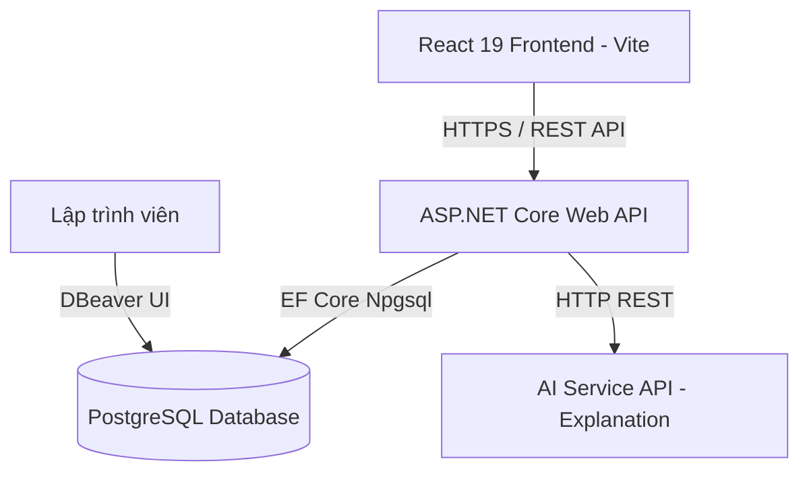
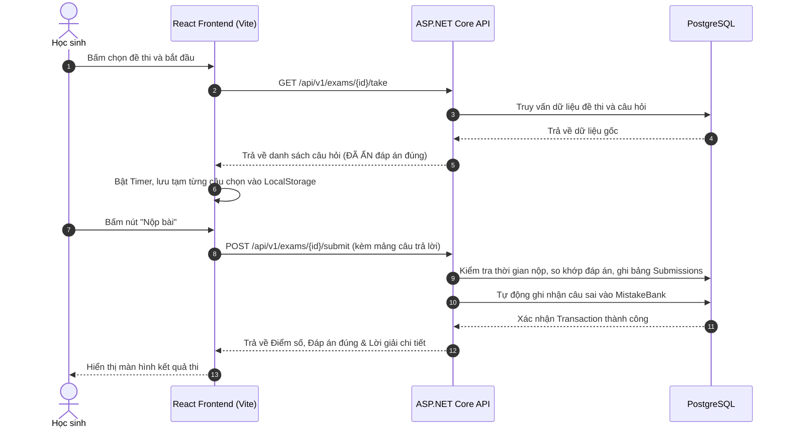

# Kiến Trúc Tổng Quan Hệ Thống (System Overview)

## 1. Định Vị Công Nghệ
* **Backend:** C# ASP.NET Core Web API (.NET 10 LTS) áp dụng Clean Architecture.
* **Frontend:** React 19 + TypeScript (khởi tạo qua Vite), Tailwind CSS, shadcn/ui.
* **Database:** PostgreSQL (tận dụng kiểu dữ liệu `JSONB` cho cấu trúc câu hỏi động).
* **Công cụ quản trị dữ liệu:** DBeaver Community (thao tác trực quan tương tự SSMS).
* **ORM:** Entity Framework Core (EF Core) Code-First Migrations.
* **API Spec:** Tự động sinh tài liệu qua OpenAPI / Scalar tích hợp trong ASP.NET Core.

## 2. Sơ Đồ Khối Hệ Thống

## 3. Luồng Dữ Liệu Thi & Chấm Điểm (Exam Flow)

